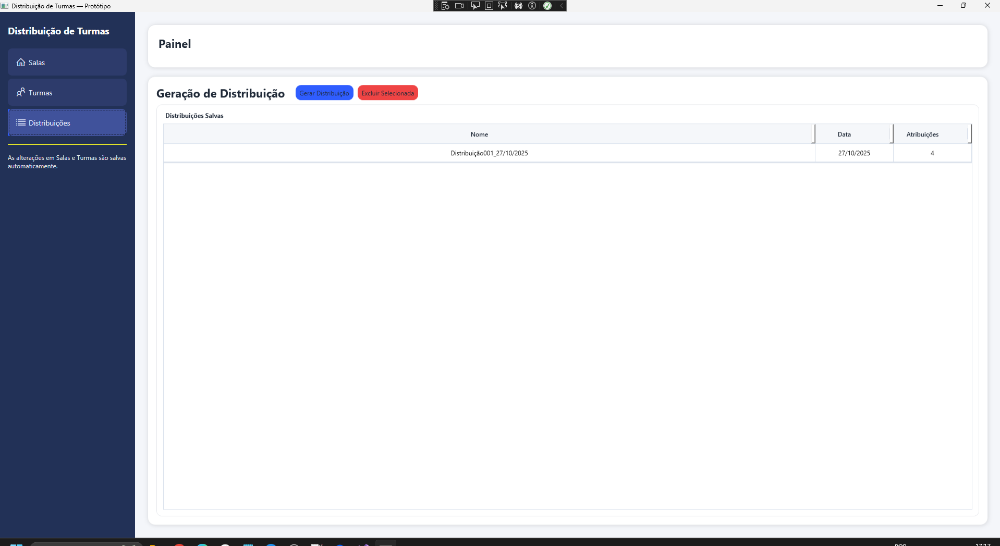

🏫 Distribuição de Turmas — Aplicativo Desktop WPF
==================================================

> Sistema desktop desenvolvido em **C# (WPF + MVVM)** para gerenciamento e distribuição de salas e turmas escolares, com interface moderna e responsiva.

--------------------------------------------------
📖 Sobre o Projeto
--------------------------------------------------

O **Distribuição de Turmas** é um software desktop construído em **.NET WPF** com arquitetura **MVVM**, projetado para facilitar o controle de salas, capacidades e recursos (como presença de computadores).  

A aplicação oferece uma interface simples, leve e moderna, com foco em produtividade e organização.

--------------------------------------------------
✨ Funcionalidades
--------------------------------------------------

- 📋 **Gerenciamento de Salas** — cadastro, edição e exclusão de salas de aula.
- 💻 **Atributos Dinâmicos** — controle de capacidade e indicação se a sala possui computadores.
- 🧩 **Interface Moderna** — DataGrid estilizado, alinhamento visual consistente e feedback visual intuitivo.
- 🖱️ **Edição Direta** — alteração de dados diretamente na tabela.
- 🪟 **Janela Maximizada** — abre automaticamente em tela cheia.
- 🧠 **MVVM Pattern** — separação clara entre camada de interface, lógica de negócio e dados.
- 💾 **Armazenamento Persistente** — integração com `StorageService` (Singleton) para manter o estado entre telas.

--------------------------------------------------
🧱 Estrutura do Projeto
--------------------------------------------------

DistribuicaoTurmas/
│
├── Models/
│   └── Room.cs
│
├── ViewModels/
│   └── RoomsViewModel.cs
│
├── Views/
│   ├── RoomsPage.xaml
│   ├── RoomsPage.xaml.cs
│   └── DistributionPage.xaml
│
├── Services/
│   └── StorageService.cs
│
├── App.xaml
├── MainWindow.xaml
└── README.md

--------------------------------------------------
🧩 Tecnologias Utilizadas
--------------------------------------------------

Categoria | Ferramenta / Tecnologia
-----------|--------------------------
💻 Linguagem | C#
🖼️ Framework | .NET WPF (Windows Presentation Foundation)
🧠 Arquitetura | MVVM (Model-View-ViewModel)
🎨 UI | XAML com estilos personalizados
📦 Padrão de Comando | RelayCommand
🗄️ Persistência | StorageService (Singleton)

--------------------------------------------------
🚀 Como Executar
--------------------------------------------------

🧰 Pré-requisitos:
- Visual Studio 2022 ou superior  
- .NET Framework 4.7.2 ou superior  
- Windows 10 ou superior

▶️ Passos:

1. Clonar o repositório:
   git clone https://github.com/seu-usuario/DistribuicaoTurmas.git

2. Abrir o projeto no Visual Studio:
   Arquivo → Abrir → Projeto/Solução → selecione o `.sln`

3. Compilar e executar:
   Pressione F5 ou clique em **Iniciar Depuração**

4. A aplicação abrirá **maximizada** automaticamente.

--------------------------------------------------
🧠 Estrutura MVVM
--------------------------------------------------

Model → representa as entidades (ex: `Room.cs` com propriedades `Number`, `Capacity`, `HasComputers`)

ViewModel → lógica de negócio e comandos (`RoomsViewModel` com `AddRoomCommand` e `RemoveSelectedCommand`)

View → interface XAML (ex: `RoomsPage.xaml` e `DistributionPage.xaml`)

--------------------------------------------------
🖌️ Visual da Interface
--------------------------------------------------

(Opcional: adicionar aqui um print da interface)

--------------------------------------------------
⚙️ Configurações Importantes
--------------------------------------------------

- A janela principal (`MainWindow.xaml`) abre maximizada:
  `<Window WindowState="Maximized" />`

- O `DataGrid` permite edição direta, com commit automático ao sair da célula.

- ComboBox configurado com interação direta entre linhas.

--------------------------------------------------
💡 Possíveis Extensões Futuras
--------------------------------------------------

- Integração com banco de dados SQLite  
- Distribuição automática de turmas conforme capacidade  
- Relatórios em PDF ou Excel  
- Filtro e busca de salas  
- Autenticação multiusuário  

--------------------------------------------------
👨‍💻 Autor
--------------------------------------------------

**Max Fulco**  
💼 Desenvolvedor e analista de sistemas  
📧 max@izzi.com.br  
🌐 https://izzi.com.br

--------------------------------------------------
📝 Licença
--------------------------------------------------

MIT License © 2025 Max Fulco  
Sinta-se livre para usar, modificar e distribuir com os devidos créditos.

--------------------------------------------------
⭐ Contribuição
--------------------------------------------------

1. Faça um fork do projeto  
2. Crie uma branch para sua feature:  
   git checkout -b minha-feature  
3. Commit suas alterações:  
   git commit -m "Adiciona nova funcionalidade X"  
4. Faça o push:  
   git push origin minha-feature  
5. Abra um Pull Request

--------------------------------------------------
📦 Versão Atual
--------------------------------------------------

v1.0.0 — Build Inicial

--------------------------------------------------
🏁 Status do Projeto
--------------------------------------------------

✅ Em funcionamento e pronto para uso local.
